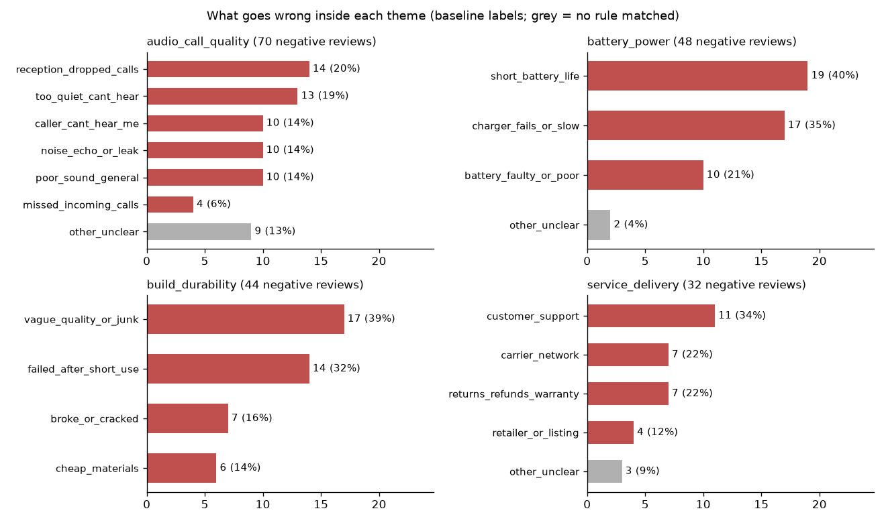

# LLM review categoriser

> 🚧 **In progress.** Done so far: data, theme taxonomy, offline baseline, Claude backend (mock-tested), a first theme analysis, an accuracy check against a hand-labelled gold sample, and a sub-issue drill-down of the negative themes.

**Business question:** a product team gets hundreds of short reviews. Which *themes* (battery, call quality, durability, delivery…) drive the negative ones, so the team knows what to fix first?

Reading reviews by hand doesn't scale. This project labels every review with one business theme, using an LLM (Claude) when an API key is available and an offline keyword baseline otherwise. It then measures which themes carry the most negative feedback.

## Data
[UCI Sentiment Labelled Sentences](https://archive.ics.uci.edu/dataset/331/sentiment+labelled+sentences) (Kotzias et al., 2015), Amazon cell-phone file: 1,000 one-sentence reviews of phones and accessories, each labelled positive or negative. Licence: **CC BY 4.0**. It's fetched by `scripts/download_data.py` (58 KB). After trimming and removing exact duplicates, 990 reviews remain (497 negative, 493 positive).

## Approach
1. **Taxonomy** (`reviewcat/taxonomy.py`): 9 themes a product/support team can act on: `battery_power`, `audio_call_quality`, `build_durability`, `fit_comfort`, `ease_of_use`, `features_design`, `value_price`, `service_delivery`, and `general_sentiment` for reviews with no specific aspect.
2. **Two interchangeable backends:**
   - `reviewcat/baseline.py`: a whole-word keyword scorer. It's free, offline and reproducible, and serves as the benchmark.
   - `reviewcat/llm.py`: Claude (`claude-haiku-4-5`) labels 25 reviews per call. A forced tool call makes it return JSON restricted to the theme list, and invalid or missing answers fall back to `general_sentiment`.
3. **Analysis** (`scripts/analyse_themes.py`): theme × sentiment table, negative rate per theme, and each theme's share of all negatives.

## First results (keyword baseline)
⚠️ These are **baseline labels**, not LLM labels. No API key was available for this run. The baseline is 63.3% accurate on the gold sample (see below), so read these as directional.


| Theme | Reviews | Negative rate | Share of all negatives |
|---|---:|---:|---:|
| general_sentiment | 411 | 47.2% | 39.0% |
| audio_call_quality | 129 | 54.3% | 14.1% |
| battery_power | 79 | 60.8% | 9.7% |
| build_durability | 67 | 65.7% | 8.9% |
| ease_of_use | 72 | 47.2% | 6.8% |
| service_delivery | 53 | 60.4% | 6.4% |
| fit_comfort | 61 | 44.3% | 5.4% |
| value_price | 62 | 41.9% | 5.2% |
| features_design | 56 | 39.3% | 4.4% |

Full table: [`results/theme_summary_baseline.md`](results/theme_summary_baseline.md).

**What this suggests so far:**
- **Call/audio quality is the biggest named source of complaints** (14.1% of all negatives). It's also the most-discussed aspect.
- **Durability, battery and service are the most negative themes** when they're mentioned (60–66% negative). Those are quality and after-sales problems, not taste.
- **Price, design and fit lean positive.** These aren't where customers are unhappy.
- **The baseline's weakness isn't the size of `general_sentiment`** (41.5% of reviews; the gold sample has 38.7% truly general). It's *routing*: specific complaints that don't use obvious keywords end up in the wrong theme. See the accuracy check below.

## How accurate is the baseline?
Labelling 150 reviews by hand is cheap, and without it nobody knows whether to trust the theme shares above. So 150 reviews were drawn at random (seed 42) and labelled from the text alone, following written rules in [`data/gold/LABELLING_GUIDE.md`](data/gold/LABELLING_GUIDE.md). There was one annotator, so the gold set is a careful reference, not perfect truth. `scripts/evaluate.py` scores any backend against it.


| Theme | Gold | Precision | Recall |
|---|---:|---:|---:|
| battery_power | 9 | 100% | 100% |
| value_price | 11 | 100% | 72.7% |
| general_sentiment | 58 | 71.0% | 75.9% |
| fit_comfort | 7 | 71.4% | 71.4% |
| audio_call_quality | 16 | 56.5% | 81.2% |
| service_delivery | 8 | 46.2% | 75.0% |
| features_design | 20 | 100% | 25.0% |
| build_durability | 13 | 40.0% | 30.8% |
| ease_of_use | 8 | 7.7% | 12.5% |

**Overall: 63.3% accuracy, macro F1 0.597.** Full report with all 55 disagreements: [`results/evaluation_baseline.md`](results/evaluation_baseline.md).

**What this means for the earlier findings:**
- **Trust battery and price.** Keywords like "battery", "charge" and "price" are unambiguous, so those theme numbers hold.
- **Durability is undercounted.** The baseline finds only 4 of 13 durability reviews. Complaints like "doesn't last long", "had to switch 3 times" and "a puff of smoke came out" have no keyword, so the real durability problem is probably bigger than the 8.9% of negatives shown above.
- **Design is undercounted too** (5 of 20 found). "REALLY UGLY", "nice leather" and "love the colors" are missed, and buttons/screens get pulled into other themes.
- **`ease_of_use` is mostly noise** (1 of 13 predictions correct). The word "bluetooth" sends product names ("Excellent bluetooth headset") into it. Its 6.8% share of negatives shouldn't be used for decisions.
- **Audio is slightly overcounted** (56.5% precision): "missed calls" or "receiving a call" match call keywords even when the problem is a feature or a fault.

These are the cases where meaning matters more than words, which is exactly what an LLM should handle better. The same script will score the Claude backend once a key is available (`python scripts/evaluate.py --backend llm`).

## What goes wrong inside each theme?
"Battery" isn't something a team can fix. "The charger doesn't work" is. `scripts/drilldown.py` splits the negative reviews of the four most-complained-about themes into sub-issues using ordered rules (`reviewcat/subissues.py`, first match wins). Reviews that match no rule are counted as `other_unclear` instead of being forced into a bucket.



| Theme (negatives) | Top sub-issues |
|---|---|
| audio_call_quality (70) | reception / dropped calls 14 (20.0%), too quiet to hear the caller 13 (18.6%), caller can't hear me 10 (14.3%), noise / echo / sound leak 10 (14.3%), poor sound in general 10 (14.3%), missed incoming calls 4 (5.7%), unclear 9 (12.9%) |
| battery_power (48) | short battery life 19 (39.6%), **charger doesn't work or is slow 17 (35.4%)**, battery poor or faulty (no detail) 10 (20.8%), unclear 2 |
| build_durability (44) | vague "poor quality / junk" 17 (38.6%), **failed after days to months 14 (31.8%)**, broke or cracked 7 (15.9%), cheap materials 6 (13.6%) |
| service_delivery (32) | customer support 11 (34.4%), mobile carrier (Verizon, Sprint…) 7 (21.9%), returns / refunds / warranty 7 (21.9%), retailer or listing 4 (12.5%), unclear 3 |

Example quotes for every sub-issue: [`results/drilldown_baseline.md`](results/drilldown_baseline.md). Every single assignment, for auditing: [`results/subissues_baseline.csv`](results/subissues_baseline.csv).

**Products that simply don't work.** Across *all* themes, 46 of 497 negative reviews (9.3%) say the product doesn't work, broke or died ("Doesn't Work.", "Lasted one day and then blew up."). Only 13 of them were routed to `build_durability`. 13 sit in `general_sentiment`, 12 in `battery_power` (mostly chargers) and 7 in `audio_call_quality`. So a theme view alone hides how big the "dead on arrival or soon after" problem is.

**What this means for the business:**
- **Chargers are a quick win.** A charger is the simplest accessory in the range, yet charger faults are almost as common as short battery life (17 vs 19 reviews). Several are compatibility mismatches ("does not charge the Cingular 8525", "not a match between the phone and the charger"), which a clearer compatibility list on the listing could prevent.
- **Durability is a failure-rate problem, not a looks problem.** Where reviewers are specific, most describe the product failing after a short time in use (14) or breaking (7). That points to supplier quality checks and warranty data, not redesign.
- **Audio has no single fix.** Complaints split evenly between reception, volume, microphone and noise. Hearing problems in either direction (too quiet, or the caller can't hear me) are the biggest group (23 of 70, 32.9%). Reception complaints (20%) partly depend on the carrier's network, which the brand doesn't control.
- **Over a fifth of "service" complaints are about the carrier**, not the seller (7 of 32). Those should be reported separately so the seller's own support score isn't blamed for them.
- **Many complaints carry no detail** (38.6% of durability, 20.8% of battery). Asking for a structured reason at return time ("stopped working / broke / didn't fit / not compatible") would turn these into usable data.

**Caveats:** these use the keyword baseline's theme labels (63.3% accurate), so some reviews start in the wrong theme. Most `other_unclear` reviews are exactly those (e.g. "Over charge shipping" sits under battery). The rules were written after reading these same reviews, so there's no held-out check, and the counts are small. Treat the shares as a ranking of what to look at first, not as precise rates.

## How to run
```bash
python -m venv .venv && source .venv/bin/activate
pip install -r requirements.txt
python scripts/download_data.py
python scripts/prepare_data.py
python scripts/run_categoriser.py          # auto: Claude if ANTHROPIC_API_KEY is set, else baseline
python scripts/analyse_themes.py --backend baseline
python scripts/evaluate.py --backend baseline   # accuracy vs the gold sample
python scripts/drilldown.py --backend baseline  # sub-issues inside the negative themes
pytest                                     # offline tests; the LLM client is mocked
```
To use Claude, copy `.env.example` to `.env` and add your `ANTHROPIC_API_KEY`. Then run `run_categoriser.py --backend llm` and `analyse_themes.py --backend llm`.

## Next steps
- Score the Claude backend on the gold sample once an API key is available.
- Ranked recommendations and limitations.
