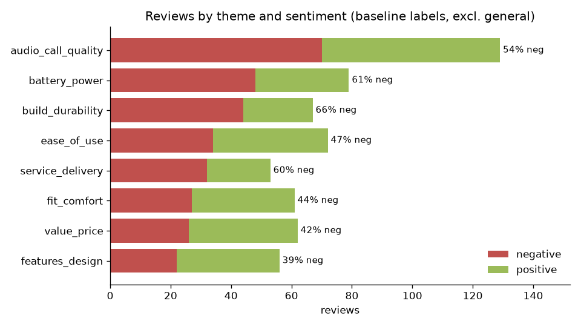
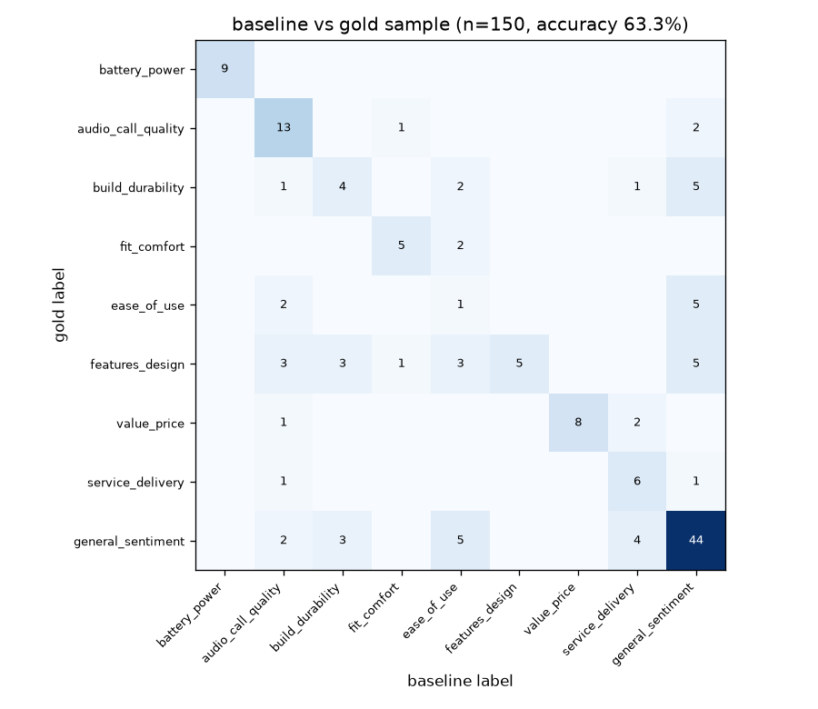

# LLM review categoriser

> 🚧 **In progress.** Done so far: data, theme taxonomy, offline baseline, Claude backend (mock-tested), a first theme analysis, and an accuracy check against a hand-labelled gold sample.

**Business question:** a product team gets hundreds of short reviews. Which *themes* (battery, call quality, durability, delivery…) drive the negative ones, so the team knows what to fix first?

Reading reviews by hand doesn't scale. This project labels every review with one business theme, using an LLM (Claude) when an API key is available and an offline keyword baseline otherwise. It then measures which themes carry the most negative feedback.

## Data
[UCI Sentiment Labelled Sentences](https://archive.ics.uci.edu/dataset/331/sentiment+labelled+sentences) (Kotzias et al., 2015), Amazon cell-phone file: 1,000 one-sentence reviews of phones and accessories, each labelled positive or negative. Licence: **CC BY 4.0**. It's fetched by `scripts/download_data.py` (58 KB). After trimming and removing exact duplicates, 990 reviews remain (497 negative, 493 positive).

## Approach
1. **Taxonomy** (`reviewcat/taxonomy.py`): 9 themes a product/support team can act on: `battery_power`, `audio_call_quality`, `build_durability`, `fit_comfort`, `ease_of_use`, `features_design`, `value_price`, `service_delivery`, and `general_sentiment` for reviews with no specific aspect.
2. **Two interchangeable backends:**
   - `reviewcat/baseline.py`: a whole-word keyword scorer. It's free, offline and reproducible, and serves as the benchmark.
   - `reviewcat/llm.py`: Claude (`claude-haiku-4-5`) labels 25 reviews per call. A forced tool call makes it return JSON restricted to the theme list, and invalid or missing answers fall back to `general_sentiment`.
3. **Analysis** (`scripts/analyse_themes.py`): theme × sentiment table, negative rate per theme, and each theme's share of all negatives.

## First results (keyword baseline)
⚠️ These are **baseline labels**, not LLM labels. No API key was available for this run. The baseline is 63.3% accurate on the gold sample (see below), so read these as directional.



| Theme | Reviews | Negative rate | Share of all negatives |
|---|---:|---:|---:|
| general_sentiment | 411 | 47.2% | 39.0% |
| audio_call_quality | 129 | 54.3% | 14.1% |
| battery_power | 79 | 60.8% | 9.7% |
| build_durability | 67 | 65.7% | 8.9% |
| ease_of_use | 72 | 47.2% | 6.8% |
| service_delivery | 53 | 60.4% | 6.4% |
| fit_comfort | 61 | 44.3% | 5.4% |
| value_price | 62 | 41.9% | 5.2% |
| features_design | 56 | 39.3% | 4.4% |

Full table: [`results/theme_summary_baseline.md`](results/theme_summary_baseline.md).

**What this suggests so far:**
- **Call/audio quality is the biggest named source of complaints** (14.1% of all negatives). It's also the most-discussed aspect.
- **Durability, battery and service are the most negative themes** when they're mentioned (60–66% negative). Those are quality and after-sales problems, not taste.
- **Price, design and fit lean positive.** These aren't where customers are unhappy.
- **The baseline's weakness isn't the size of `general_sentiment`** (41.5% of reviews; the gold sample has 38.7% truly general). It's *routing*: specific complaints that don't use obvious keywords end up in the wrong theme. See the accuracy check below.

## How accurate is the baseline?
Labelling 150 reviews by hand is cheap, and without it nobody knows whether to trust the theme shares above. So 150 reviews were drawn at random (seed 42) and labelled from the text alone, following written rules in [`data/gold/LABELLING_GUIDE.md`](data/gold/LABELLING_GUIDE.md). There was one annotator, so the gold set is a careful reference, not perfect truth. `scripts/evaluate.py` scores any backend against it.



| Theme | Gold | Precision | Recall |
|---|---:|---:|---:|
| battery_power | 9 | 100% | 100% |
| value_price | 11 | 100% | 72.7% |
| general_sentiment | 58 | 71.0% | 75.9% |
| fit_comfort | 7 | 71.4% | 71.4% |
| audio_call_quality | 16 | 56.5% | 81.2% |
| service_delivery | 8 | 46.2% | 75.0% |
| features_design | 20 | 100% | 25.0% |
| build_durability | 13 | 40.0% | 30.8% |
| ease_of_use | 8 | 7.7% | 12.5% |

**Overall: 63.3% accuracy, macro F1 0.597.** Full report with all 55 disagreements: [`results/evaluation_baseline.md`](results/evaluation_baseline.md).

**What this means for the earlier findings:**
- **Trust battery and price.** Keywords like "battery", "charge" and "price" are unambiguous, so those theme numbers hold.
- **Durability is undercounted.** The baseline finds only 4 of 13 durability reviews. Complaints like "doesn't last long", "had to switch 3 times" and "a puff of smoke came out" have no keyword, so the real durability problem is probably bigger than the 8.9% of negatives shown above.
- **Design is undercounted too** (5 of 20 found). "REALLY UGLY", "nice leather" and "love the colors" are missed, and buttons/screens get pulled into other themes.
- **`ease_of_use` is mostly noise** (1 of 13 predictions correct). The word "bluetooth" sends product names ("Excellent bluetooth headset") into it. Its 6.8% share of negatives shouldn't be used for decisions.
- **Audio is slightly overcounted** (56.5% precision): "missed calls" or "receiving a call" match call keywords even when the problem is a feature or a fault.

These are the cases where meaning matters more than words, which is exactly what an LLM should handle better. The same script will score the Claude backend once a key is available (`python scripts/evaluate.py --backend llm`).

## How to run
```bash
python -m venv .venv && source .venv/bin/activate
pip install -r requirements.txt
python scripts/download_data.py
python scripts/prepare_data.py
python scripts/run_categoriser.py          # auto: Claude if ANTHROPIC_API_KEY is set, else baseline
python scripts/analyse_themes.py --backend baseline
python scripts/evaluate.py --backend baseline   # accuracy vs the gold sample
pytest                                     # offline tests; the LLM client is mocked
```
To use Claude, copy `.env.example` to `.env` and add your `ANTHROPIC_API_KEY`. Then run `run_categoriser.py --backend llm` and `analyse_themes.py --backend llm`.

## Next steps
- Score the Claude backend on the gold sample once an API key is available.
- Break down the negative reviews within each theme (what exactly goes wrong) and write ranked recommendations.
